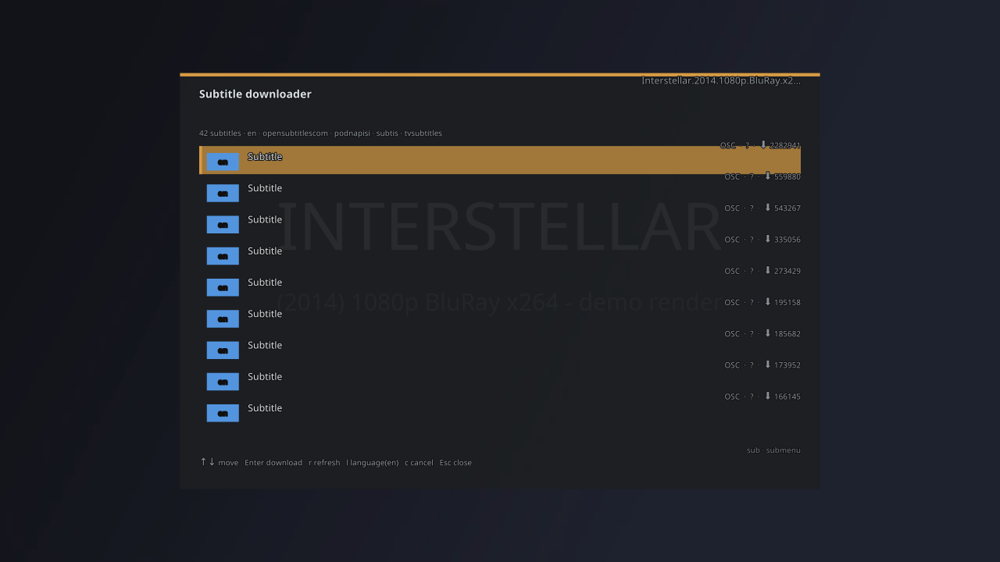

# mpv subtitle downloader

A small native GTK4/Libadwaita popup for **mpv** that finds subtitles on
**OpenSubtitles.com** via the same REST API the official VLSub extension
uses. Pick a result and it's saved **next to the video file** so mpv
auto-loads it — or loaded straight into the running player over its JSON
IPC socket. No OSD rendering, no web front-end, full keyboard navigation.



## Requirements

- Python 3.12+
- GTK4 + Libadwaita with PyGObject (system packages — the distro-specific
  list is in `install.sh`'s prerequisites check)
- mpv with `--input-ipc-server` support (the script sets it up for you)
- `guessit` (pip) — everything else is the Python standard library
- network access to `api.opensubtitles.com` (a free account is required)

## Install

### Automated (`install.sh`)

The bundled `install.sh` does the whole setup: fetch the source, create a
venv, install the pip dependency, copy the mpv script and write
`script-opts/mpvsub.conf`. It needs `git`, `python3` (3.12+) and the
GTK4/Libadwaita Python bindings — it checks for them and prints the
distro-specific install command if any are missing.

Install with curl:

```sh
curl -fsSL https://raw.githubusercontent.com/rubiin/mpvsub/master/install.sh | bash
```

Or from a checkout:

```sh
git clone https://github.com/rubiin/mpvsub ~/mpvsub
cd ~/mpvsub
bash install.sh
```

`install.sh` overrides: `MPVSUB_REPO_URL` (clone URL), `MPVSUB_DIR` (install
location, default `~/mpvsub`), `XDG_CONFIG_HOME` (mpv config
root). It checks for `python3` (3.12+) and the GTK4/Libadwaita Python
bindings (plus `git`, for the remote path) and prints the
distro-specific install command if any are missing.

### Manual

```sh
# 1. Python backend (recommended: a venv, but any python with gi works)
python3 -m venv --system-site-packages .venv
.venv/bin/pip install -r requirements.txt

# 2. mpv script — copy the lua to your mpv scripts folder
cp mpvsub.lua ~/.config/mpv/scripts/

# 3. point the script at main.py and the venv python (options live in
#    script-opts/, NOT scripts/ — mpv reads them from there)
mkdir -p ~/.config/mpv/script-opts
cat > ~/.config/mpv/script-opts/mpvsub.conf <<EOF
python=/home/you/mpvsub/.venv/bin/python3
app=/home/you/mpvsub/main.py
EOF
```

Then press **CTRL+g** in mpv (or bind your own key in
`script-opts/mpvsub.conf`). The popup opens with a hash search for the
current file already running.

## Uninstall

Remove everything the installer creates:

```sh
# 1. mpv script + options (the CTRL+g binding disappears on mpv restart)
rm ~/.config/mpv/scripts/mpvsub.lua
rm ~/.config/mpv/script-opts/mpvsub.conf     # and any mpvsub.conf.bak it made

# 2. the checkout + venv
rm -rf ~/mpvsub

# 3. app settings (credentials) + cached data
rm -rf ~/.config/mpvsub-subtitles
rm -rf ~/.local/share/mpvsub-subtitles
```

Optional, if you want a complete sweep: remove the `subs` alias from your
shell rc, and any fallback downloads in `~/.local/share/mpv/subtitles/`
(saved there only by name searches without a local file). Restart mpv so
its key binding is released.

## Usage

The popup is a compact, fixed-size 700×500 window with the classic labelled
form — about five or six result rows are visible at once and the list
scrolls for the rest:

- **Subtitles language** — dropdown with the full OpenSubtitles language
  list (99 languages, including `pt-br`, `zh-cn`, `zh-tw`, …); the last
  selection is remembered.
- **Search by hash** — finds subtitles for the exact file on disk via the
  OpenSubtitles movie hash; no typing needed. If the hash has no matches it
  automatically falls back to a name search (like VLSub).
- **Title / Search by name** — type a movie or series title (season/episode
  are auto-detected with guessit and can be edited in the Season and
  Episode fields), then press Enter or click **Search by name**.
- **IMDB ID** — search directly by IMDB id (`tt1375666`) instead of a title.
- **Sort by** — the OpenSubtitles API sort options: Best match (client-side
  scoring), Downloads, New downloads, Ratings, Votes, Upload date, Trusted
  uploader, HD, Release — plus an **↑ Asc / ↓ Desc**  direction toggle.
  Sorting is applied server-side via `order_by`/`order_direction` (except
  Best match, which is scored locally).
- **Results list** — a scrollable list showing ~5-6 rows at first, one
  Subtitle Name column spanning the full width (with a **HI** badge for
  hearing-impaired releases). Rows highlight on hover;
  **double-click downloads immediately**.
- **Download selection** — saves **next to the video file** when you're
  searching a local file (`<name>.<lang>.srt`, auto-loaded by mpv); name
  searches without a local file use the download directory
  (`~/.local/share/mpv/subtitles/`). Existing files are overwritten safely
  — an interrupted download never corrupts a subtitle. It also loads the
  subtitle into mpv (`sub-add` + `sid`) and shows a **Subtitle loaded.**
  toast.
- **Show help / Show config** — key bindings and current settings.
- **Close** — closes the popup.

### Keys

| Key | Action |
|-----|--------|
| `↑` / `↓` | move through results |
| `Enter` | download the selected row |
| `Double-click` | download that row |
| `Ctrl+F` | focus the search entry |
| `Ctrl+R` | refresh search |
| `Esc` | close |

### Running from the command line

Launch the app directly from a terminal (use the venv python if you created
one during install):

```sh
.venv/bin/python3 main.py                              # search by name only
.venv/bin/python3 main.py /path/to/video.mkv           # hash-search a file
.venv/bin/python3 main.py --socket /tmp/mpv.sock       # connect to a running mpv
.venv/bin/python3 main.py --socket /tmp/mpv.sock --file /path/to/video.mkv
```

| Option | Meaning |
|--------|---------|
| `<video>` (positional) | video file to hash-search for subtitles |
| `--socket <path>` | mpv JSON IPC unix socket to connect to |
| `--file <path>` | video file (combined with `--socket`) |
| `--query <text>` | search a title by name on startup |
| `--debug` | verbose logging (search/download results) |
| `--width <px>` / `--height <px>` | override the default 700×500 window size |

When connected to mpv, the popup follows media changes automatically and
sub-adds downloads into the player. Without a socket it still works — files
are just saved to disk. For a quick launcher, drop an alias in your shell rc:

```sh
alias subs='/home/you/mpvsub/.venv/bin/python3 /home/you/mpvsub/main.py'
```

(replace `/home/you/mpvsub` with your checkout path, then `subs` opens the
popup, `subs /path/to/video.mkv` hash-searches a file).

## Downloading (credentials)

The API needs an **Api-Key** on every request — this app uses the one
shipped with the official VLSub extension. It also needs an account, so
the app logs in with your **username/password** on each start. Provide
them as env vars:

```sh
export OPENSUBTITLES_USERNAME=you@example.com
export OPENSUBTITLES_PASSWORD=secret
```

or in `~/.config/mpvsub-subtitles/settings.json`:

```json
{
  "username": "you@example.com",
  "password_obfuscated": "…"
}
```

Your password is never stored in plaintext — it's obfuscated with a
machine-local key (derived from `/etc/machine-id`) before saving. Because
the key stays on this machine, copying `settings.json` elsewhere won't
decode it: just re-enter it via the **Account…** button. A legacy
plaintext `password` entry is still read and migrated to the obfuscated
form on the next save.

Env vars win over the settings file. The **Account…** dialog (also in the
bottom action bar) pops up on first run — when there's no `settings.json`
yet — and whenever a search fails on missing or wrong credentials. Saving
valid ones re-runs the failed search automatically.

## Configuration

Settings live in `~/.config/mpvsub-subtitles/settings.json` (last
languages, sort mode + direction, download dir, encoding, credentials).
The download directory only matters for searches without a local video —
subtitles for a file on disk are saved right next to it. Change it there
if you want that fallback elsewhere.

## Troubleshooting

**“No OpenSubtitles credentials configured” / login errors**

Every request needs a free OpenSubtitles account — the API has no anonymous
mode. The **Account…** button (bottom action bar) opens the login dialog by
itself on first run and whenever a search fails with a credential or login
error, so usually you just type your username/password once. Alternatives:

- Set `OPENSUBTITLES_USERNAME` and `OPENSUBTITLES_PASSWORD` in your
  environment — env vars take precedence over the saved settings.
- A wrong password shows `Login failed: … — check your OpenSubtitles
  credentials.` — re-enter them via **Account…**.
- The account must be registered at opensubtitles.com (free accounts work).

**Hash search returns nothing**

An empty hash search falls back to a name search automatically when the
file's title can be parsed, but a miss usually means the exact file isn't
in OpenSubtitles' hash database — common for rare releases, re-encodes, or
odd filenames. Try, in order:

1. **Search by name** — type the title and press Enter.
2. **IMDB ID** — the most reliable query (`tt1375666`); the API matches on
   it directly.
3. **Switch the language dropdown** — the search is filtered to the
   selected language, so if none of its subtitles exist the list is empty.
4. Remember hash search needs a local file on disk — for network streams
   or name-only searches there is nothing to hash (you'll see the “Hash
   search needs a local file” banner).

**“Service unavailable (503)” / “Too many requests (429)”**

The app retries transient `503`/`429` download errors automatically with a
short backoff before showing the message, but these are server-side:
OpenSubtitles' load balancer periodically 503s for everyone and the free
tier is rate-limited. Wait a few minutes and press **Ctrl+R** to retry. A
`429` usually clears within a minute; persistent `503`s are an
OpenSubtitles outage — not a problem with this app or your account.

**Subtitle downloads but mpv doesn't load it**

The toast `Saved to … — start mpv with --input-ipc-server to auto-load`
means the app wasn't connected to mpv. Open the file in mpv and press
**CTRL+g** — the script sets up the IPC socket for you — or launch mpv with
`--input-ipc-server=/path/to/sock` and start `main.py` with
`--socket /path/to/sock`. The file must also keep the same basename as the
video (it's saved as `<name>.<lang>.srt` next to the video).

## Notes

- Only subtitles are ever fetched — never video content.
- Network streams (e.g. `ytdl://`) fall back to a name search using the
  media title.
- Search results are cached in memory for 10 minutes (keyed by query +
  sort mode); the login token is cached for 24 hours and re-fetched
  automatically on `401`.
- Transient download errors (`503` overloaded / `429` rate-limited) are
  retried automatically with a short backoff before an error is shown.
  OpenSubtitles' download service occasionally 503s for everyone — that is
  server-side and usually clears in minutes.

## Project layout

```
main.py                 entry point / CLI parsing
app.py                  Adw.Application (single instance)
models.py               dataclasses + OpenSubtitles language catalog
settings.py             persistent settings (JSON) + sort modes
cache.py                in-memory TTL search cache
search.py               guessit metadata, query building, scoring/sorting
opensubtitles_client.py OpenSubtitles REST API v1 facade (stdlib urllib)
moviehash.py            OpenSubtitles movie-hash computation
ipc.py                  mpv JSON IPC client (unix socket)
ui/                     GTK4 widgets (window, search bar, list, dialogs)
mpvsub.lua              mpv script: socket setup + launcher (CTRL+g)
mpvsub.conf             mpv script options
install.sh              curl|bash installer (see Install)
assets/                 icons
tests/                  logic + download-flow tests (.venv/bin/python3 tests/test_logic.py; .venv/bin/python3 tests/test_download.py)
```

The API client is ported from the official VLSub extension
([opensubtitles/vlsub-opensubtitles-com](https://github.com/opensubtitles/vlsub-opensubtitles-com)),
minus its i18n and VLC-UI code.
